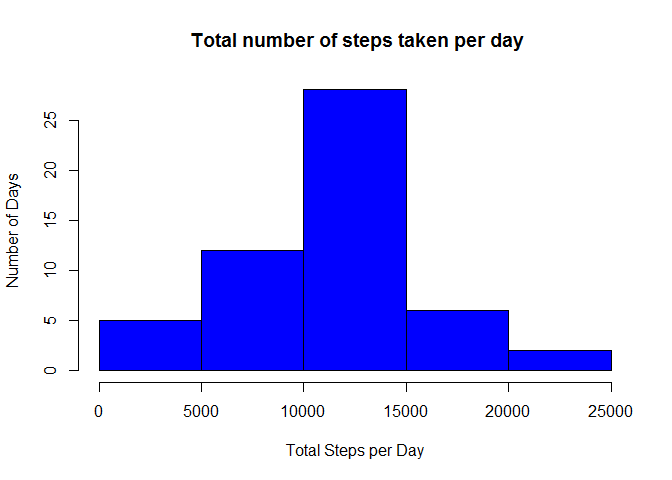

# Reproducible Research: Peer Assessment 1

This assignment makes use of data from a personal activity monitoring device. This device collects data at 5 minute intervals through out the day. The data consists of two months of data from an anonymous individual collected during the months of October and November, 2012 and include the number of steps taken in 5 minute intervals each day.

The variables included in this dataset are:

- steps: Number of steps taking in a 5-minute interval (missing values are coded as NA)

- date: The date on which the measurement was taken in YYYY-MM-DD format

- interval: Identifier for the 5-minute interval in which measurement was taken

The dataset is stored in a comma-separated-value (CSV) file and there are a total of 17,568 observations in this dataset.


## Loading and preprocessing the data


```r
amdata <- read.csv("activity.csv")
amdata[,2] <- as.Date(as.character(amdata[,2]), format = "%Y-%m-%d")
```
Converted the date data from factor to date format.

## What is mean total number of steps taken per day?
- summarize steps per day
- create histgram
- calculate mean and median


```r
stepsbydate <- aggregate(steps ~ date, data = amdata, sum, na.rm = TRUE)
hist(stepsbydate$steps, main = " Total number of steps taken per day", xlab = "Total Steps per Day", 
     ylab = "Number of Days", col = "blue")
```

 

```r
mean(stepsbydate$steps)
```

```
## [1] 10766.19
```

```r
median(stepsbydate$steps)
```

```
## [1] 10765
```

## What is the average daily activity pattern?

- summarize total steps by interval
- create line chart
- find the intreval with max number of steps

```r
stepsbyinterval <- aggregate(steps ~ interval, data = amdata, sum, na.rm = TRUE)
plot(stepsbyinterval$interval, stepsbyinterval$steps, type="l", xlab="Interval",
     ylab = "Number of Steps", col = "blue")
```

 

```r
maxinterval <- stepsbyinterval[which.max(stepsbyinterval$steps),1]
sprintf("The 5-minute interval containing the maximum number of steps is %i", maxinterval)
```

```
## [1] "The 5-minute interval containing the maximum number of steps is 835"
```


## Imputing missing values
- find number of rows with missing data

```r
countNA <- sum(is.na(amdata))
countNA
```

```
## [1] 2304
```

- replace the NA with the mean of number of steps per 5 min interval


```r
temp <- mean(amdata[,1], na.rm=TRUE)
amdata[is.na(amdata[,1]),1] <- temp
```
- create a histogram as in previous section and show the mean and median


```r
stepsbydate <- aggregate(steps ~ date, data = amdata, sum, na.rm = TRUE)
hist(stepsbydate$steps, main = " Total number of steps taken per day", xlab = "Total Steps per Day", 
     ylab = "Number of Days", col = "red")
```

 

```r
mean(stepsbydate$steps)
```

```
## [1] 10766.19
```

```r
median(stepsbydate$steps)
```

```
## [1] 10766.19
```

Compared to part #1, the mean remains the same at 10766.19 but the median has increased slightly from 10765 to 10766.19 to now mirror the mean.


## Are there differences in activity patterns between weekdays and weekends?

- Use weekdays() function to augment the dataset and enable a comparison between weekdays and weekend days


```r
daytype <- data.frame(sapply(X = amdata$date, FUN = function(day) {
          if (weekdays(as.Date(day)) %in% c("Monday", "Tuesday", "Wednesday", "Thursday", 
                                            "Friday")) {
                    day <- "weekday"
          } else {
                    day <- "weekend"
          }
}))

amdata1 <- cbind(amdata, daytype)

colnames(amdata1) <- c("steps", "date", "interval", "daytype")
```
- aggregate the data to calculate the mean


```r
amdata2 <- aggregate( data=amdata1, steps ~ daytype + interval,FUN=mean)
```

- create panel chart showing number of steps during the week versus weekend


```r
library("lattice")

xyplot(
          type="l",
          data=amdata2,
          steps ~ interval | daytype,
          xlab="Interval",
          ylab="Number of steps",
          layout=c(1,2)
)
```

 


